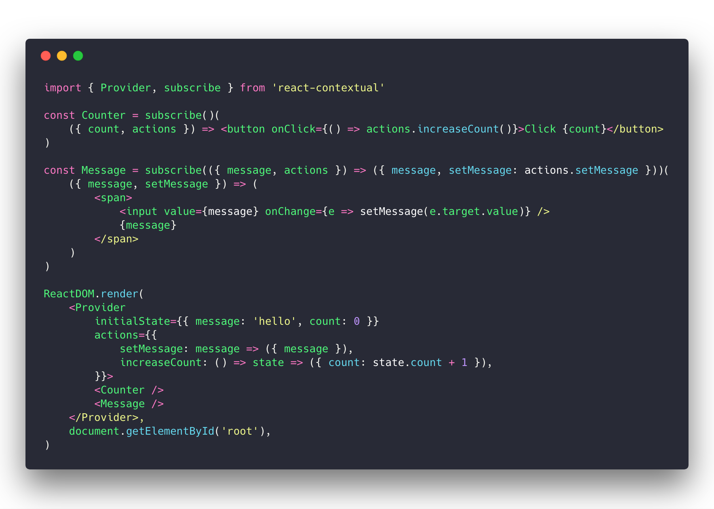
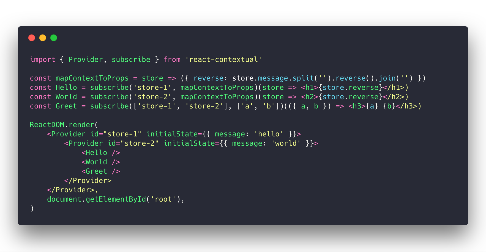
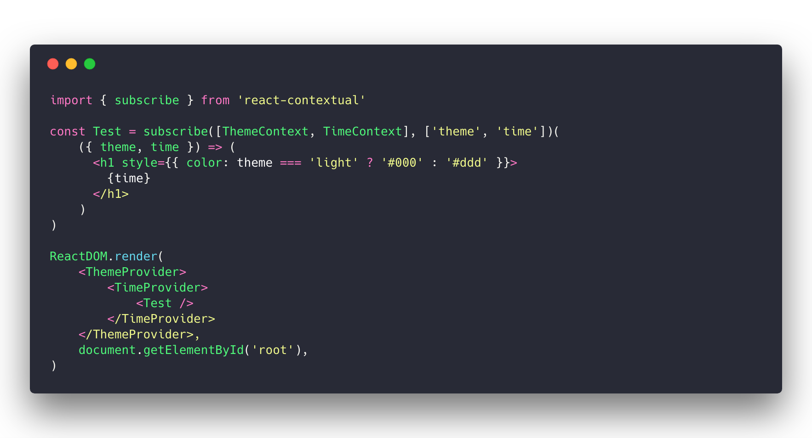
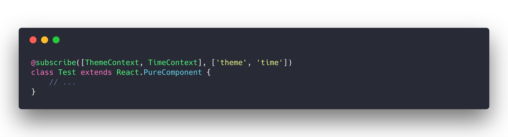
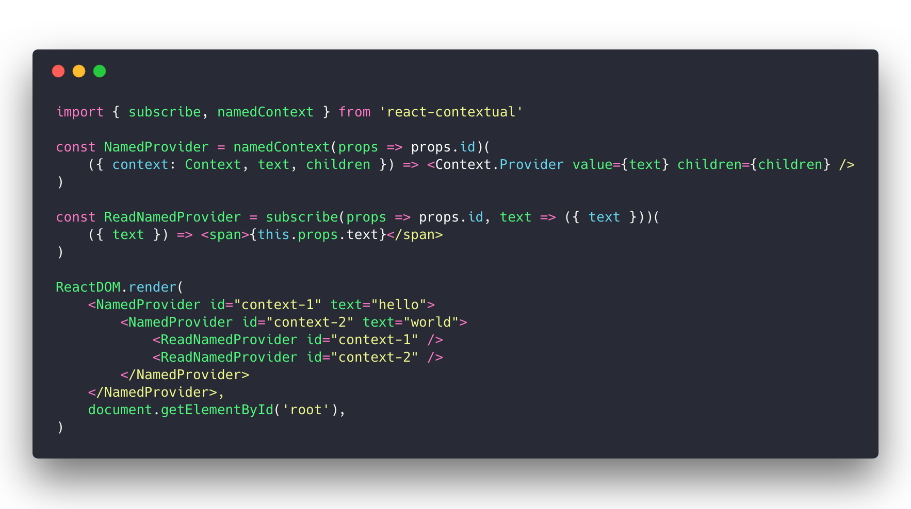
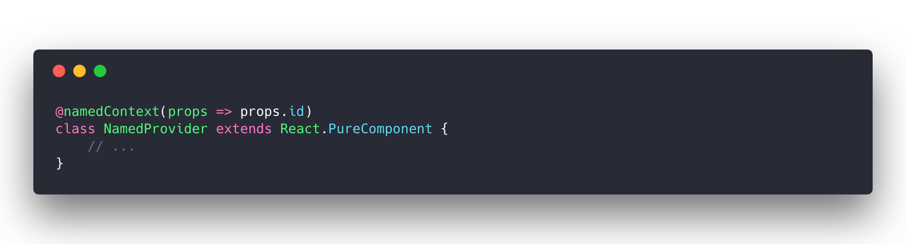
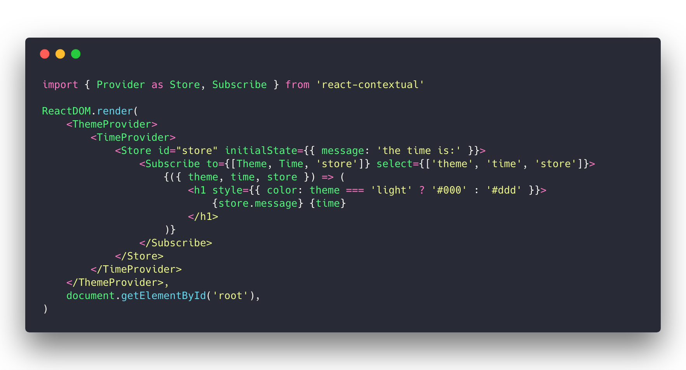

`react-contextual` is a tiny (less than 1KB) helper around [React 16s new context api](https://github.com/acdlite/rfcs/blob/new-version-of-context/text/0000-new-version-of-context.md).

It provides two things:

* consuming (and creating) context with ease, every kind of context, no matter which or whose or how many providers
* a minimal redux-like store pattern with setState semantics and central actions

# Why

Reacts new context api is very powerful albeit very low-level as it does not prescribe patterns and can cause some issues if used naively. `react-contextual` makes creating, sharing and consuming context easier, maps context values to component props similar to how redux operates, takes care of nesting, renders only when necessary and provides a small store for state distribution.

Click [this link](https://github.com/drcmda/react-contextual/blob/master/PITFALLS.md) for as more detailed explanation.

# Installation

    npm install react-contextual

# If you just need a light-weight no-frills store

Use the [Provider](https://github.com/drcmda/react-contextual/blob/master/API.md#provider) to distribute state and actions, wrap consumers within, use [subscribe](https://github.com/drcmda/react-contextual/blob/master/API.md#subscribe) to connect components.

Example 1: https://codesandbox.io/s/ywyr3q5n4z (basic example)

Example 2: https://codesandbox.io/s/lxly45lvkl (async actions)

### With decorator

But use with care as the spec may still change any time!

### What about multiple stores?

You can have as many as you like, just name them. [subscribe](https://github.com/drcmda/react-contextual/blob/master/API.md#subscribe) also accepts your keys.

Example: https://codesandbox.io/s/p9p6jq60lx

# If you are dealing with context providers of any kind

[subscribe](https://github.com/drcmda/react-contextual/blob/master/API.md#subscribe) helps you to consume *any* React context. Soon libs like react-router, redux, etc. will likely start serving context. Look into the examples to see how easy it is to create a context provider in order to distribute dynamic data.

Example: https://codesandbox.io/s/5v7n6k8j5p

### With decorator

# If you like to create context providers

Reacts default api works with singletons, that makes it tough to create multi-purpose, nestable providers. Use [namedContext](https://github.com/drcmda/react-contextual/blob/master/API.md#namedcontext) to create unique context bound to a components lifecycle and [moduleContext](https://github.com/drcmda/react-contextual/blob/master/API.md#modulecontext) for module-scoped context. Use [helper functions](https://github.com/drcmda/react-contextual/blob/master/API.md#imperative-context-handling) if you want to control the lifecycle of a context by yourself.

Example1: https://codesandbox.io/s/m7q5z407p9 (namedContext)

Example2: https://codesandbox.io/s/v8pn13nq77 (moduleContext)

Example3: https://codesandbox.io/s/30ql1rxzlq (imperate API)

### With decorator

# If you like to consume context but dislike HOCs

Use [Subscribe](https://github.com/drcmda/react-contextual/blob/master/API.md#subscribe-as-a-component) (a component) to do the same as above with render props.

Example 1: https://codesandbox.io/s/wo28o5y1y5 (Multiple providers)

Example 2: https://codesandbox.io/s/ko1nz4j2r (Store as default provider)

# API

https://github.com/drcmda/react-contextual/blob/master/API.md

# Changelog

https://github.com/drcmda/react-contextual/blob/master/CHANGELOG.md

# Pitfalls when using the context api raw

https://github.com/drcmda/react-contextual/blob/master/PITFALLS.md

# Who is using it

