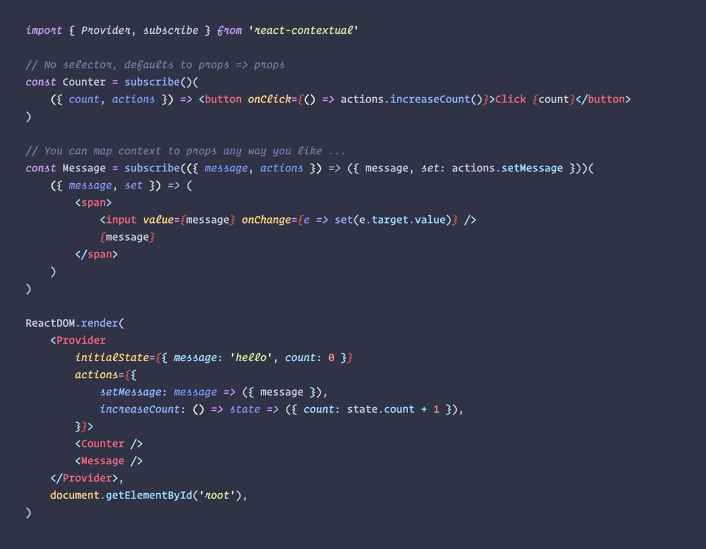
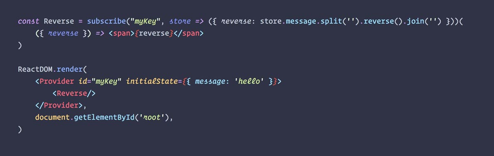
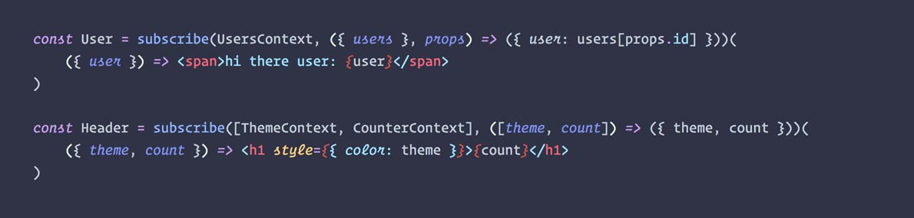
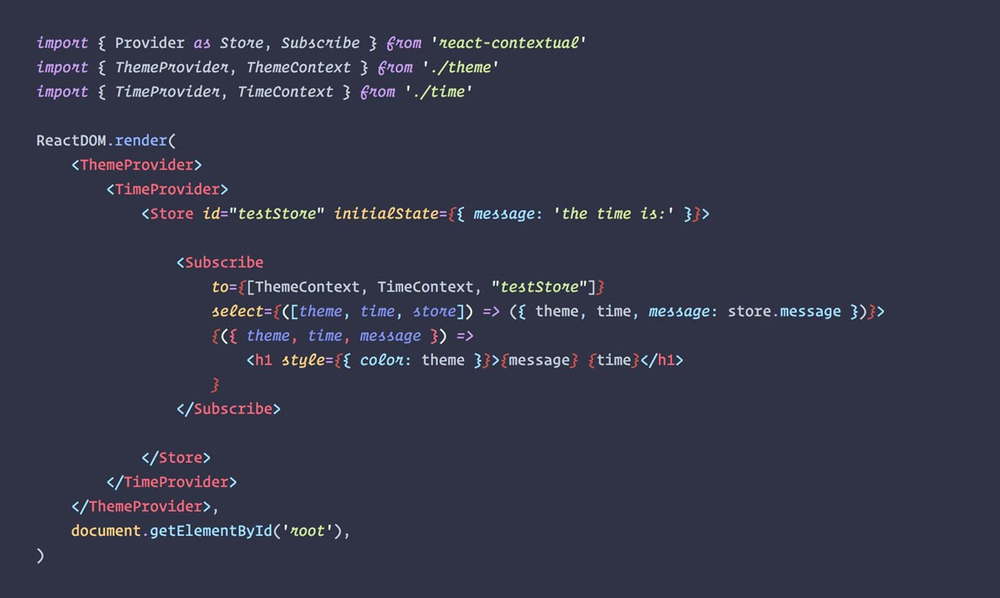

`react-contextual` is a tiny (~1KB) helper around [React 16's new context API](https://github.com/acdlite/rfcs/blob/new-version-of-context/text/0000-new-version-of-context.md).

It provides two things:

* consuming context with ease, every kind of context, no matter which or whose or how many providers
* a minimal redux-like store pattern with setState semantics and central actions

# Why

Reacts new API for dynamic context distribution is built on render props. While it is very powerful it may be a little too low-level depending on how many consumers you deal with due to the nesting. `react-contextual` can fix that by mapping context values to component props, similar to how Redux operates. It also provides a small store for state distribution. It could well be [the smallest flux-store yet](https://github.com/drcmda/react-contextual/blob/master/src/store.js).

# Installation

    npm install react-contextual

# How to use ...

```js
import { subscribe, Subscribe, Provider } from 'react-contextual'
```

1. `subscribe([providers,] [selector])(AnyComponent)`

    Higher-order component to consume context. `providers` points to one or many contexts. `selector` maps the provider values into component props. Ommit `providers` and it will use `react-contextual`'s own context for the store (the one down below, number 3 in this list). Ommit `selector` and it will default to `props => props`, so all the contexts props will be merged to the wrapped components props.

2. `<Subscribe [to={providers}] [select={selector}]>{renderFunction}</Subscribe>`

    The same as above as a component that passes selected props via render function.

3. `<Provider initialState={state} [actions={actions}]>...</Provider>`

    A small store with central actions.

# If you just need a light-weight, no-frills store ...

Provide state and actions, wrap everything that is supposed to access or mutate it within.

Example: https://codesandbox.io/s/ywyr3q5n4z



### With decorator

But use with care as the spec may still change any time!


### What about multiple stores?

You can have as many as you like, just name them. `subscribe` also accepts your keys.

Example: https://codesandbox.io/s/p9p6jq60lx



# If you're dealing with context providers of any kind

Use `subscribe` to consume any React context provider (or several).

Example: https://codesandbox.io/s/5v7n6k8j5p



### With decorator


# If you like to consume context but dislike HOC's

Example 1: https://codesandbox.io/s/wo28o5y1y5 (Multiple providers)

Example 2: https://codesandbox.io/s/ko1nz4j2r (Store as default provider)

Use `<Subscribe to={} select={}/>` to do the same as above with render props.



# API

https://github.com/drcmda/react-contextual/blob/master/API.md
