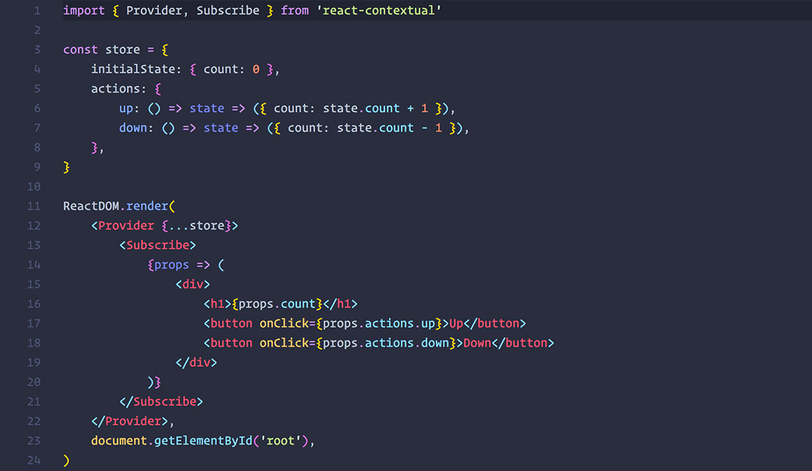
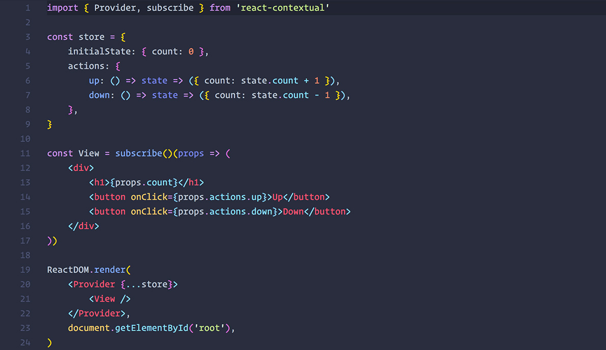
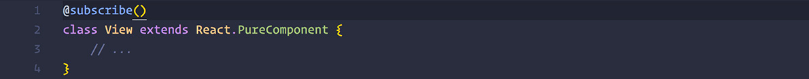
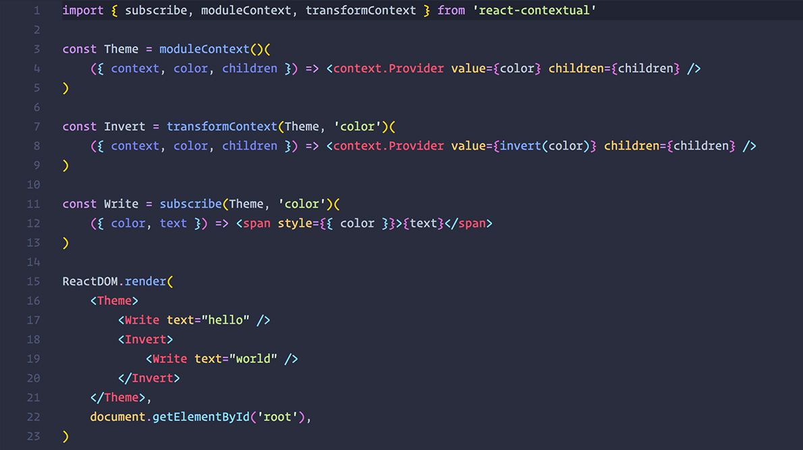
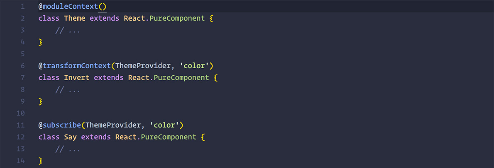

  

  

`react-contextual` is a tiny (less than 1KB) helper around [React 16s new context api](https://github.com/acdlite/rfcs/blob/new-version-of-context/text/0000-new-version-of-context.md).

It provides two things:

* consuming (and creating) context with ease, every kind of context, no matter which or whose or how many providers
* a minimal redux-like store pattern with setState semantics and central actions

# Why

Reacts new context api is very powerful albeit very low-level as it does not prescribe patterns and can cause some issues if used naively. `react-contextual` makes creating, sharing and consuming context easier, maps context values to component props similar to how redux operates, takes care of nesting, renders only when necessary and provides a small store for state distribution.

Click [this link](https://github.com/drcmda/react-contextual/blob/master/PITFALLS.md) for a detailed explanation.

# Installation

    npm install react-contextual

# If you just need a light-weight no-frills store

Use the [Provider](https://github.com/drcmda/react-contextual/blob/master/API.md#provider) to distribute state and actions, wrap consumers within. Read by using the [subscribe](https://github.com/drcmda/react-contextual/blob/master/API.md#subscribe) HOC or the [Subscribe](https://github.com/drcmda/react-contextual/blob/master/API.md#subscribe-as-a-component) component.

### Higher Order Component

### With decorator

### Examples

* [Basic example](https://codesandbox.io/embed/lxly45lvkl)
* [Async actions](https://codesandbox.io/embed/ywyr3q5n4z)
* [Memoization/Reselect](https://codesandbox.io/embed/yvx9my007z)
* [Multiple stores](https://codesandbox.io/embed/0o8pj1jz7v)

# If you like to provide context

Reacts default api works with singletons, that makes it tough to create multi-purpose, nestable providers. Use [namedContext](https://github.com/drcmda/react-contextual/blob/master/API.md#namedcontext) to create unique context bound to a components lifecycle, [moduleContext](https://github.com/drcmda/react-contextual/blob/master/API.md#modulecontext) for module-scoped context and [transformContext](https://github.com/drcmda/react-contextual/blob/master/API.md#transformcontext) to transform existing context providers (like a declarative middleware). Use [helper functions](https://github.com/drcmda/react-contextual/blob/master/API.md#imperative-context-handling) if you want to control the lifecycle of a context by yourself.

### With decorator

### Examples

* [Unique context](https://codesandbox.io/embed/ox405qqopy)
* [Global context](https://codesandbox.io/embed/v8pn13nq77)
* [Imperative context](https://codesandbox.io/embed/30ql1rxzlq)
* [Generic React Context](https://codesandbox.io/embed/55wp11lv4)
* [Transforms](https://codesandbox.io/embed/mjv84k1kn9)

***

API: https://github.com/drcmda/react-contextual/blob/master/API.md

Changelog: https://github.com/drcmda/react-contextual/blob/master/CHANGELOG.md

Pitfalls using context raw: https://github.com/drcmda/react-contextual/blob/master/PITFALLS.md

## Who is using it

